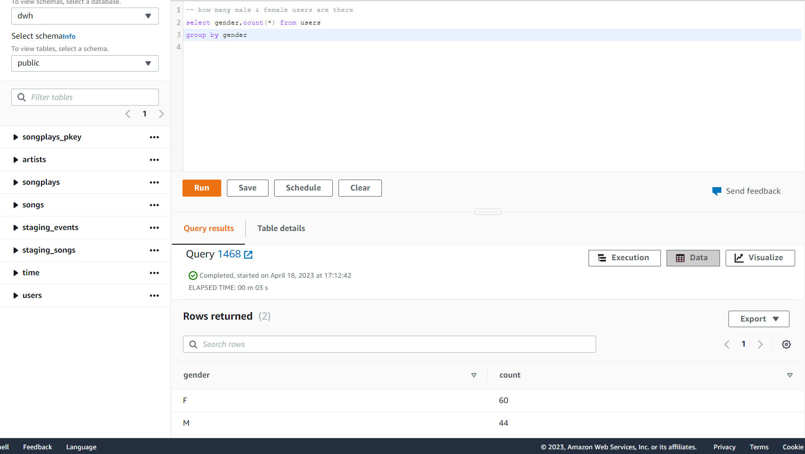
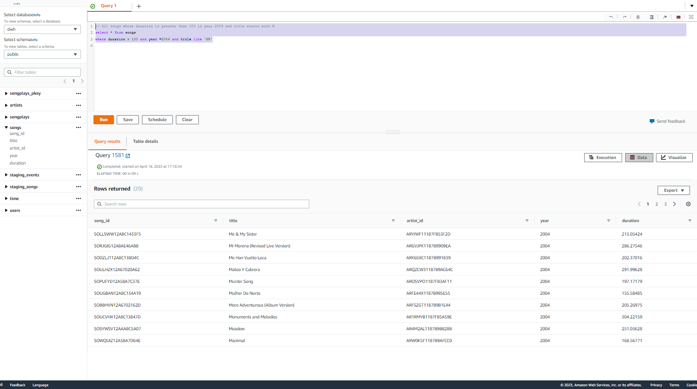
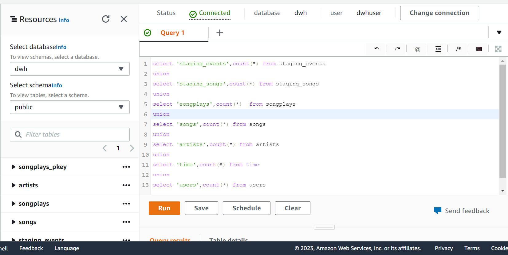
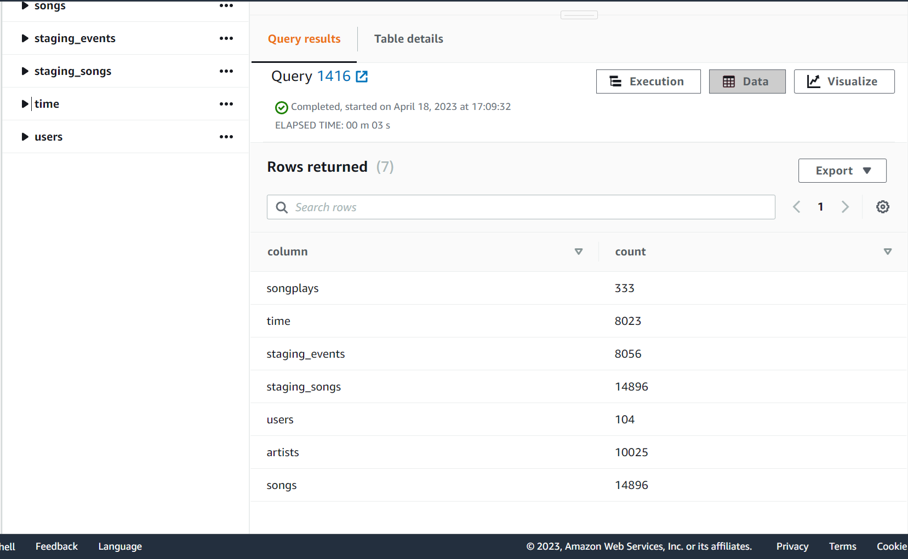

# Project Data Warehouse
## Project Overview
A music streaming startup, Sparkify, has grown their user base and song database and want to move their processes and data onto the cloud.

In this project, we will create an ETL pipeline that will extract raw data from s3 and load into staging tables on Redshift.
Then from these Staging Tables a star schema DW will be created on Redshift.

# Input data 
It is residing on S3
* Song data: s3://udacity-dend/song_data
* Log data: s3://udacity-dend/log_data
* Log data json path: s3://udacity-dend/log_json_path.json
### Data is present in JSON format. So, Appropriate Reshift queries have been applied. 
### The data from the S3 buckets is to loaded into staging area in Redshift.

# Schema Design

### Fact and Dimension tables have been created based on the below schema design from staging tables in Redshift.

  

# How to run the notebook

* I have used the IAC notebook to create the cluster programmatically from the jupyter notebook.
* First create an IAM "adminaccess" role and note down the **access and secret key**. Put these values in **dwh.cfg** file.
* Then start executing each cell of the notebook and run all cells till cluster creation. After cluster gets created.
* Check the status of the cluster if it is available and note down the **ARN & Endpoint**.Again put these values in **dwh.cfg** file.
* Then run the **!python3 create_tables.py** to drop and create the tables.
* Then run **!python3 etl.py** to create the tables in the redshift.
* Finally delete the cluster.

# Queries ran on query editor to check the tables
# Query 1 -  No of male and female users

  

# Query 2 - Find data whose song duration is greater than 100 in the year 2004 and title startswith "M"

  

# Query 3 - Shows the population of all the tables

  

  

