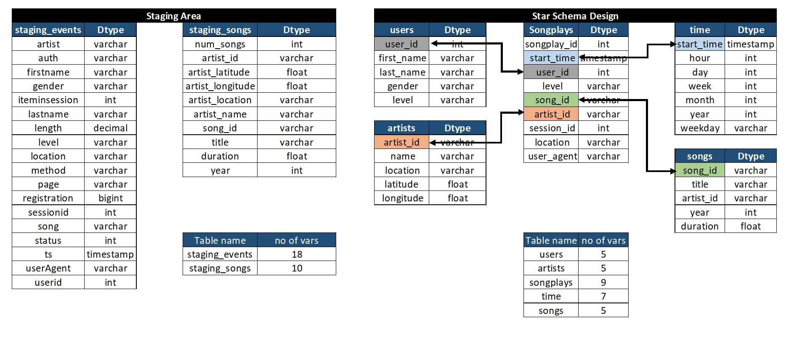
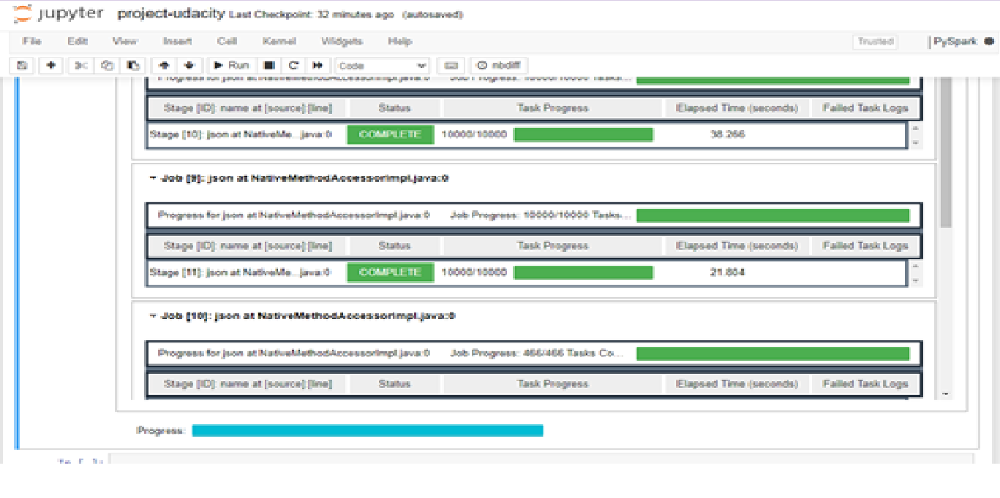
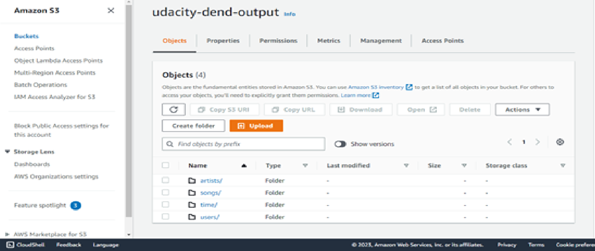
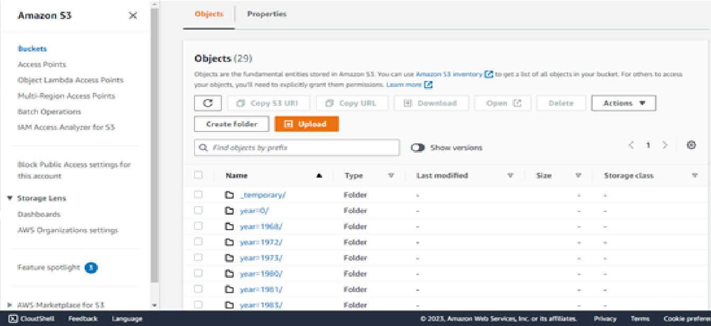

# Project Data Lake
## Project Overview
A music streaming startup, Sparkify, has grown their user base and song database even more and want to move their data warehouse to a data lake.

In this project, we will create a script/pipeline in pyspark that will extract raw data from s3 data lake (JSON) and process those files in AWS EMR.
After processing, this data will be stored in S3 data lake as parquet files.

# Input data 
Data residing on S3 data lake
* Song data: s3://udacity-dend/song_data
JSON File
song_data/A/B/C/TRABCEI128F424C983.json
File Contents
{"num_songs": 1, "artist_id": "ARJIE2Y1187B994AB7", "artist_latitude": null, "artist_longitude": null, "artist_location": "", "artist_name": "Line Renaud", "song_id": "SOUPIRU12A6D4FA1E1", "title": "Der Kleine Dompfaff", "duration": 152.92036, "year": 0}

* Log data: s3://udacity-dend/log_data
# Output data
* Songs : s3://udacity-dend-output/songs
* users : s3://udacity-dend-output/users
* artists : s3://udacity-dend-output/artists
* songplays : s3://udacity-dend-output/songplays
* time : s3://udacity-dend-output/time

### Data is present in JSON format.  
### Output data will be in Parquet format.
### AWS EMR is being used to process this big data.

# Schema Design

### Parquet files have been created based on the below schema design.(Parquet files can be queried easily)

  

# How to run the notebook

* I have used the IAC notebook to create the cluster programmatically and have used jupyter notebook **Redshift_test.ipynb**.
* First create an IAM **adminaccess** role and note down the **access and secret key**. Put these values in **dwh.cfg** file.
* Then start executing each cell of the notebook and run all cells till cluster creation. After cluster gets created.
* Check the status of the cluster if it is available. Note down the **ARN & Endpoint**. Again put these values in **dwh.cfg** file.
* Then run the **!python3 create_tables.py** to drop and create the tables.
* Then run **!python3 etl.py** to create the tables in the redshift.
* Run some queries on **Query Editor**.
* Finally delete the cluster.

# EMR Notebook Snapshots
# Code starts running on EMR Notebook

  

# Songs folder created on S3

  

# Data started getting populated in S3 in songs Folder

  

